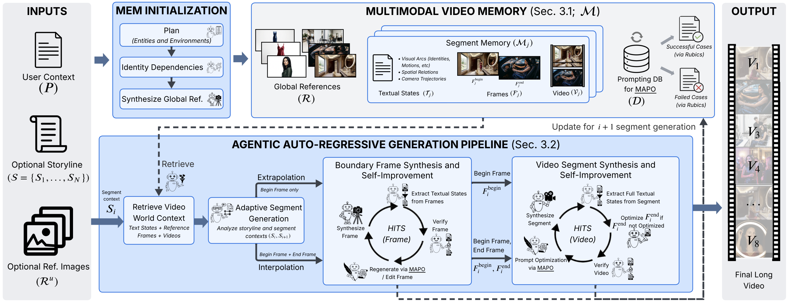
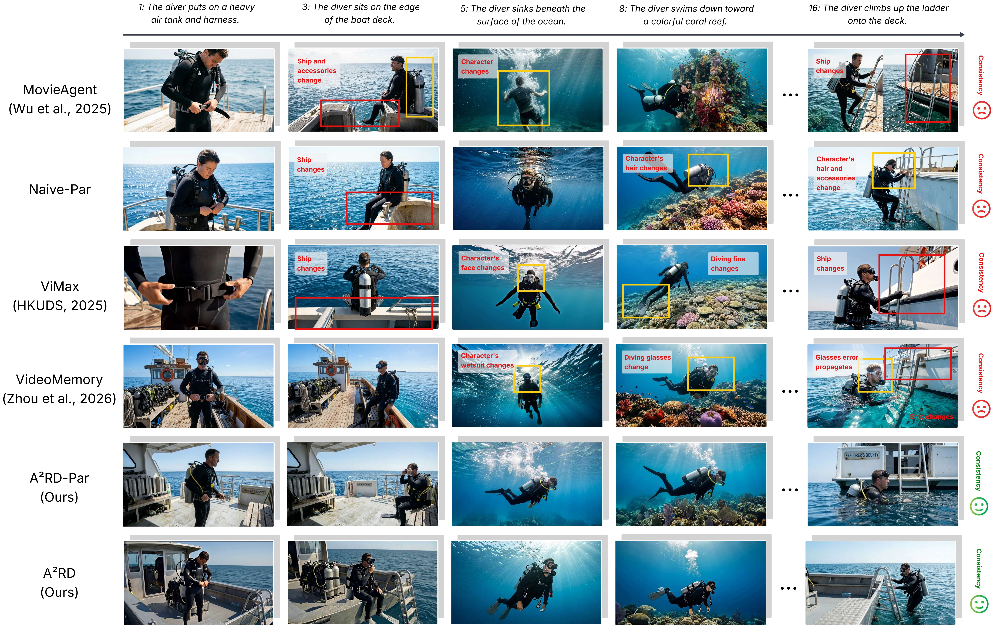
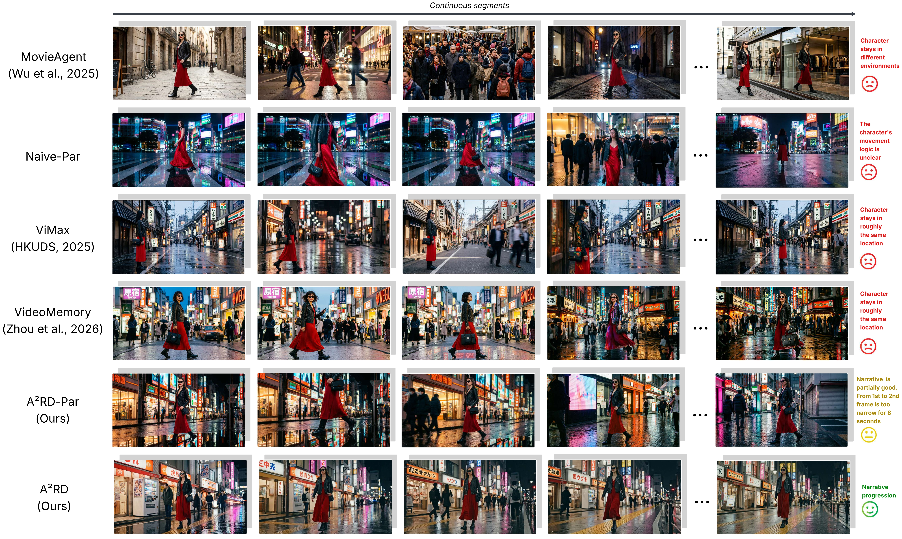
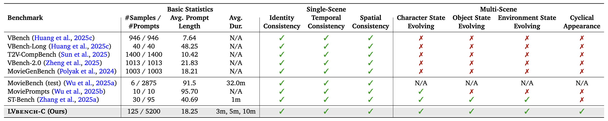

#  A²RD: Agentic Autoregressive Diffusion for Long Video Consistency

  <a href="https://dxlong2000.github.io/AARD/">🌐 Project Page</a>

## Abstract

Synthesizing consistent and coherent long video remains a fundamental challenge. Existing methods suffer from semantic drift and narrative collapse over long horizons. We present **A²RD**, an Agentic Auto-Regressive Diffusion architecture that enables video diffusion models to synthesize and self-improve long videos autoregressively, enforcing temporal consistency and narrative coherence. A²RD is training-free and built upon three pillars:

- **Multimodal Video Memory**: Disentangles each segment into Textual States, Frames, and Videos to maintain both visual and narrative coherence.
- **Adaptive Segment Generation**: Adaptively selects between extrapolation and interpolation per segment based on narrative structure.
- **Hierarchical Test-Time Self-Improvement (HITS)**: Self-improves boundary frames and full segments hierarchically to prevent error cascading.

Across public and LVBench-C benchmarks spanning one- to ten-minute videos, A²RD outperforms state-of-the-art baselines by up to **30% in consistency** and **20% in narrative coherence**.

## Synthesized Videos

For full video gallery, please visit our [Project Page](https://dxlong2000.github.io/AARD/).

## Teasers

Examples of how A²RD preserves narrative coherence and temporal consistency:

🔍 Temporal Consistency

🔍 Narrative Progression

## LVBench-C Benchmark

We introduce **LVBench-C** (Long Video Bench-Challenge), a benchmark designed to stress-test temporal consistency under complex scenarios where entities and environments appear, disappear, and reappear across long horizons with optional state changes.

## Dataset

Coming soon.

## Citation

## Acknowledgements

This project page is based on the [Nerfies](https://github.com/nerfies/nerfies.github.io) template.
